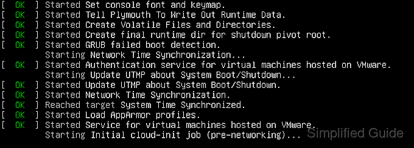

# So führen Sie das Programm beim Linux-Start automatisch aus
<!-- Quelle: https://www.simplified.guide/linux/automatically-run-program-on-startup -->
<!-- -->
Der Linux-Start ist in einige Phasen unterteilt. Sie können jedes Programm so einstellen, dass es in jeder Phase automatisch startet, egal ob es sich um einen einzelnen Befehl, eine Befehlskette oder ein ausführbares Shell-Skript handelt. 
Es kann jedoch einige Unterschiede im Startvorgang zwischen verschiedenen Linux-Distributionen und -Versionen geben.  



Modernes Linux bootet zuerst in systemd, während ältere Linux-Versionen System V init verwenden. 
Unabhängig davon werden sie schließlich cron und rc.local ausführen, bevor sie die Desktop-Umgebung wie GNOME oder KDE laden. 
Auf der anderen Seite laden serverbasierte Linux-Distributionen die Desktop-Umgebung nicht, sondern bieten sofort eine Anmeldeaufforderung an der Konsole und führen dann die Standard-Shell wie Bash aus, nachdem sich der Benutzer angemeldet hat.  

    Methoden zum automatischen Ausführen des Programms beim Linux-Start:  

    [Verwaltung mit systemd]()  
    [Erstellen Sie einen Cronjob]()  
    [Ausführen mit rc.local]()  
    [Wird beim Start von GNOME ausgeführt]()  
    [Wird beim Start von KDE ausgeführt]()  
    [In einer neuen Bash-Sitzung ausführen]()  

## Programm automatisch beim Linux-Start über systemd ausführen

systemd ist der Standardsystem- und Dienstmanager in modernem Linux. 
Es ist unter anderem für die Ausführung und Verwaltung von Programmen während des Linux-Starts verantwortlich. 
Kompatible Programme stellen Service-Unit-Dateien bereit, die von systemd verwendet werden, um die Ausführung des Programms zu verwalten.  

Sie können systemd so konfigurieren, dass Programme während des Linux-Starts automatisch ausgeführt werden, indem Sie die folgenden Schritte ausführen:  

       1. Prüfen Sie, ob eine Service Unit für Ihr Programm existiert (optional).  

       ```
       $ sudo systemctl list-unit-files --type=service
       [sudo] password for user:
       UNIT FILE                              STATE
       accounts-daemon.service                enabled
       apparmor.service                       enabled
       apport-autoreport.service              static
       apport-forward@.service                static
       apport.service                         generated
       apt-daily-upgrade.service              static
       apt-daily.service                      static
       atd.service                            enabled
       autovt@.service                        enabled
       blk-availability.service               enabled
       bootlogd.service                       masked
       bootlogs.service                       masked
       bootmisc.service                       masked
       checkfs.service                        masked
       checkroot-bootclean.service            masked
       checkroot.service                      masked
       cloud-config.service                   enabled
       cloud-final.service                    enabled
       cloud-init-local.service               enabled
       cloud-init.service                     enabled
       console-getty.service                  disabled
       ##### snipped #####
       ```
	   
       Sie müssen Ihre eigene Service-Unit erstellen, wenn es sich um ein benutzerdefiniertes Programm handelt oder wenn Ihr Programm während der Installation keine enthält.  
	   Siehe auch: [Erstellen und Ändern von systemd-Unit-Dateien](https://access.redhat.com/documentation/en-us/red_hat_enterprise_linux/8/html/configuring_basic_system_settings/assembly_working-with-systemd-unit-files_configuring-basic-system-settings).  

    2. Prüfen Sie, ob die Wartungseinheit aktiviert ist (optional).  

       ```
       $ sudo systemctl is-enabled mysql
       disabled
       ```

       aktivierte Diensteinheit wird während des Bootens ausgeführt. 

    3. Aktivieren Sie die Service-Unit, die Sie während des Startvorgangs ausführen möchten.  

	   ```
       $ sudo systemctl enable mysql
       Synchronizing state of mysql.service with SysV service script with /lib/systemd/systemd-sysv-install.
       Executing: /lib/systemd/systemd-sysv-install enable mysql
       Created symlink /etc/systemd/system/multi-user.target.wants/mysql.service ? /lib/systemd/system/mysql.service.
       ```

    4. Überprüfen Sie, ob die Serviceeinheit zur Bestätigung aktiviert ist (optional).  

       ```
       $ sudo systemctl is-enabled mysql
       enabled
       ```

## Programm beim Linux-Start automatisch über cron ausführen  

cron ist ein Daemon zum Ausführen geplanter Befehle. Die Befehle werden in der Cron-Job-Tabelle oder Crontab gespeichert und sind für jeden Benutzer im System eindeutig. 
Es wird während des Systemstarts entweder von systemd oder System V init gestartet, und Sie können Ihren Job oder Ihr Programm so planen, dass es direkt während des Systemstarts selbst ausgeführt wird, indem Sie die folgenden Schritte ausführen:  

     1. Öffnen Sie den standardmäßigen Crontab-Editor.  

       ```
       $ crontab -e
       ```

       Sie müssen einen Editor für die Crontab auswählen, wenn der Benutzer den Befehl zum ersten Mal verwendet.  

       ```
       $ crontab -e
       no crontab for user - using an empty one
       
       Select an editor.  To change later, run 'select-editor'.
         1. /bin/nano        <---- easiest
         2. /usr/bin/vim.basic
         3. /bin/ed
       
       Choose 1-3 [1]:
       ```
       Für den Benutzer, der den Befehl ausführt, wird eine Crontab erstellt und mit den Rechten des Benutzers ausgeführt. 
	   Wenn Ihr Programm als Root-Benutzer ausgeführt werden soll, führen Sie crontab -e als Root-Benutzer selbst aus.  

    2. Fügen Sie eine Zeile hinzu, die mit @reboot beginnt.
       ```
       # m h  dom mon dow   Befehl
       @reboot
       ```
       @reboot definiert den Job, der während des Systemstarts ausgeführt werden soll.  

    3. Fügen Sie den Befehl ein, um Ihr Programm nach @reboot zu starten.  

       ```
       @reboot /sbin/ip addr | grep inet\ | tail -n1 | awk '{ print $2 }' > /etc/issue && echo "" >> /etc/issue
       ```

       Verwenden Sie nach Möglichkeit den vollständigen Pfad für Ihre Programme und schreiben Sie Ihre Befehle in eine einzige Zeile.  

    4. Speichern Sie die Datei, um sie in der Crontab zu installieren.  

       ```
       $ crontab -e
       crontab: installing new crontab
       $ 
       ```

       Die Datei wird in /var/spool/crontab/<Benutzername> gespeichert.  

    5. Prüfen Sie, ob crontab richtig konfiguriert ist (optional).  

       ```
       $ crontab -l
       # m h  dom mon dow   Befehl
       @reboot /sbin/ip addr | grep inet\ | tail -n1 | awk '{ print $2 }' > /etc/issue && echo "" >> /etc/issue
       ```

## Programm automatisch beim Linux-Start über rc.local ausführen
rc.local ist ein Erbe des System-V-Init-Systems. 
Es ist das letzte Skript, das ausgeführt wird, bevor ein Anmeldebildschirm für die Desktop-Umgebung oder eine Anmeldeaufforderung am Terminal angezeigt wird. 
Es ist normalerweise ein Bash-Shell-Skript, und Sie können alles über das Skript ausführen.  

Sie können Ihr rc.local-Skript folgendermaßen konfigurieren:  

    1. Öffnen oder erstellen Sie die Datei /etc/rc.local, falls sie nicht existiert, indem Sie Ihren bevorzugten Editor als Root-Benutzer verwenden.
       ```
       $ sudo vi /etc/rc.local
       ```
    2. Platzhaltercode in die Datei einfügen.
       ```
       #!/bin/bash
       
       exit 0
       ```
       Es muss mit interpreter (/bin/bash) beginnen und mit einem Exit-Code enden (0 steht für Erfolg).
	   
    3. Fügen Sie der Datei nach Bedarf Befehle und Logiken hinzu.
       ```
       #!/bin/bash
       
       /sbin/ip addr | grep inet\ | tail -n1 | awk '{ print $2 }' > /etc/issue
       echo "" >> /etc/issue
       
       exit 0
       ```

    4. Setzen Sie die Datei auf ausführbar.
       ```
       $ sudo chmod a+x /etc/rc.local
       ```
       Die Datei wird während des Systemstarts als Root-Benutzer ausgeführt.

## Programm beim Start von GNOME automatisch ausführen
GNOME ist die Standard-Desktop-Umgebung für Linux-Distributionen wie Ubuntu und Red Hat. 
GNOME kann so konfiguriert werden, dass Programme ausgeführt werden, wenn sich ein Benutzer anmeldet, und kann gemäß dem folgenden Artikel konfiguriert werden:  

Verwandt: So führen Sie das Programm beim GNOME-Start automatisch aus.  

## Programm beim KDE-Start automatisch ausführen
KDE ist eine weitere beliebte Desktop-Umgebung für Linux und ist die Standardeinstellung in Kubuntu und openSUSE. 
Es kann einfach so konfiguriert werden, dass Programme ausgeführt werden, wenn sich ein Benutzer anmeldet, wie im folgenden Artikel beschrieben:  

Verwandte: So führen Sie das Programm beim KDE-Start automatisch aus.  

## Programm bei neuer Bash-Sitzung automatisch ausführen
Ein neues Shell-Programm wird gestartet, wenn Sie Ihre Terminalsitzung starten. 
Bash ist die Standard-Shell für die meisten Linux-Distributionen, und wenn sie gestartet wird, sucht sie nach den folgenden Dateien in der bestimmten Reihenfolge und führt sie aus.  

    1. /etc/profil
    2. ~/.bash_profile
    3. ~/.bash_login
    4. ~/.profil

Diese Dateien enthalten Befehle und Logiken zum Einrichten geeigneter Umgebungsvariablen und zum Ausführen erforderlicher Programme in der Bash-Sprache. Es ist auch so konfiguriert, dass es normalerweise andere Dateien wie /etc/bashrc, /etc/bash.bashrc und ~/.bashrc ausführt.  
Sie können jede dieser Dateien bearbeiten, um Ihr Programm auszuführen, wenn eine Bash-Sitzung gestartet wird. Unten ist ein Teil einer typischen ~/.bashrc-Datei:  

       ```
       PS1='${debian_chroot:+($debian_chroot)}\[\033[01;32m\]\u@\h\[\033[00m\]:\[\033[01;34m\]\w\[\033[00m\] \$ '
 
       PATH=/home/user/bin:$PATH
 
       export EDITOR=/usr/bin/vim
 
       alias ll="ls -l"
       ``` 

